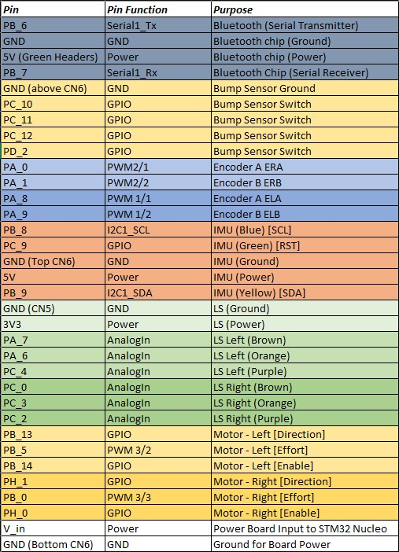
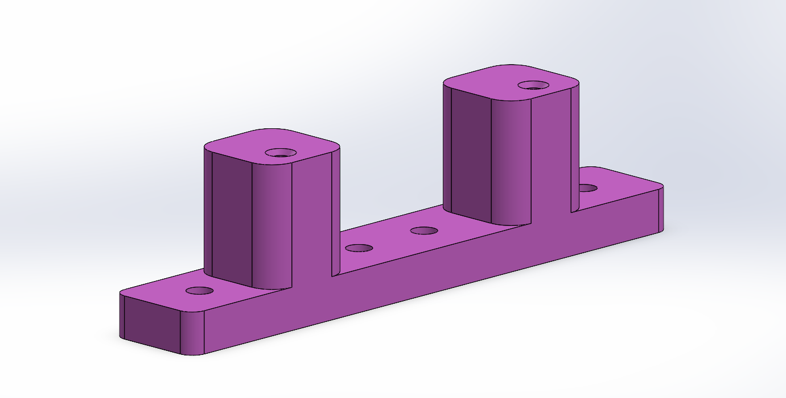
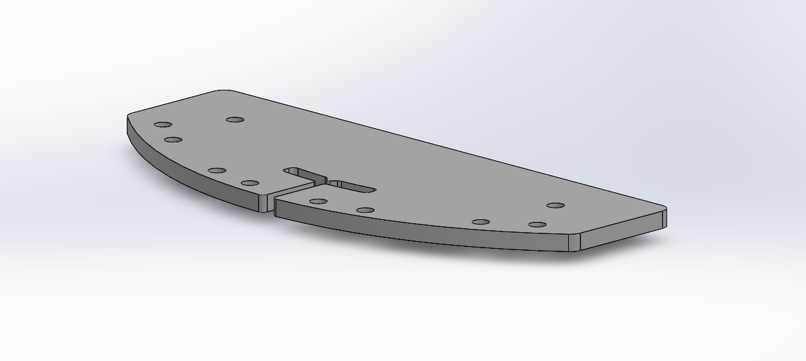

# Hardware Overview

---

## Romi Platform

The system is built on the Pololu Romi chassis, a compact differential-drive robot platform designed for rapid prototyping and educational use. It includes two DC motors with integrated gearboxes and wheel encoders, along with a stable base for mounting sensors and electronics. The differential drive configuration allows motion to be controlled through independent wheel velocities, enabling precise turning, line following, and trajectory tracking throughout the course.

---

## Microcontroller and Control Electronics

The robot is controlled using an STM32-based **Nucleo-L476RG** development board. This microcontroller provides the computational capability required for real-time task scheduling, sensor integration, and closed-loop motor control. A **Shoe of Brian** interface board was used to simplify hardware integration and provide organized access to I/O peripherals. This is a custom in-house board developed for the course, with full documentation and specifications available on the course reference site. The system operates using a cooperative, priority-based scheduler, allowing multiple tasks to run concurrently while maintaining predictable timing behavior.

---

## Motor and Encoder System

Each wheel is driven by a DC motor with a **120:1 gear ratio**, equipped with a quadrature encoder. The encoder provides **12 counts per revolution at the motor**, resulting in a significantly higher effective resolution at the wheel due to the gearbox. Encoder feedback is used in closed-loop control to regulate wheel speeds and maintain accurate trajectory tracking throughout the course. Motor drivers interface with the microcontroller to provide PWM-based speed control and direction control for each wheel.

---

## Line Sensor Array

The robot uses **Pololu QTR analog reflectance sensors**, configured as two 6-channel boards with **4 mm spacing** between sensors. Only half of the sensors on each board were utilized due to limitations in available analog input pins and because additional resolution was not necessary for reliable line detection. The sensors were mounted approximately **5 mm above the ground**, consistent with manufacturer recommendations for optimal performance. This configuration provided sufficient resolution to accurately detect line position while simplifying hardware integration and reducing computational overhead.

---

## Inertial Measurement Unit (IMU)

The system uses a **BNO055 9-DOF IMU**, which provides fused orientation and angular velocity data. The sensor was operated in full 9-DOF mode and carefully calibrated prior to operation. Calibration data was stored externally and uploaded to the IMU during system startup, ensuring consistent and accurate performance without requiring recalibration each run. Due to mounting constraints, the IMU was positioned slightly offset from the center of the robot. Despite this, it provided highly reliable heading information, which was particularly useful during garage navigation and turning maneuvers. The IMU also enabled one of the more advanced features of the system: the ability for the robot to reorient itself and restart the course without external intervention.

---

## Bump Sensors

Mechanical bump sensors were implemented using simple switches configured to trigger on a **high-to-low signal transition** when contact was made. These sensors were primarily used in the parking garage section to detect wall contact and initiate subsequent navigation behaviors.

---

## Power System

The robot is powered by a pack of **six AA batteries**. The system was initially tuned using rechargeable NiMH batteries, which limited the maximum speed to just under **900 mm/s**. A voltage divider was later incorporated to regulate and normalize the input voltage, allowing the system to operate using standard alkaline AA batteries with minimal impact on performance. This ensured more consistent operation across different power sources while maintaining reliable motor and control behavior.

---

## Wiring and Pin Configuration

  

    
    
<em>System wiring diagram showing electrical connections.</em>

  

  

    
    
<em>Microcontroller pin assignments.</em>

  

The wiring layout and pin configuration define the physical interface between the microcontroller and all hardware components. Clear organization of these connections is critical for reliable operation and simplifies debugging and system integration.

---

## Custom 3D Printed Components

  

    
    
<em>Mount for maintaining proper line sensor height and alignment.</em>

  

  

    
    
<em>Mount enabling forward placement of bump sensors for reliable contact detection.</em>

  

Custom 3D printed components were designed to support two primary functions:

- Maintaining the **line sensors at the correct height (5 mm)** and securely mounting them to the chassis, as the default mounting geometry did not align with the Romi platform  
- Positioning the **bump sensors forward of the line sensor assembly**, allowing proper contact detection without interference from wiring or sensor mounts  

These components improved both mechanical reliability and sensor performance, while also helping to organize wiring and maintain a compact system layout.

---

## System Integration

The hardware system is designed with modularity in mind, allowing individual components to be developed and tested independently before full system integration. Sensors continuously provide feedback to the control system, while actuators respond to commands generated by higher-level tasks. This integration of sensing, computation, and actuation enables the robot to navigate the course autonomously and reliably.