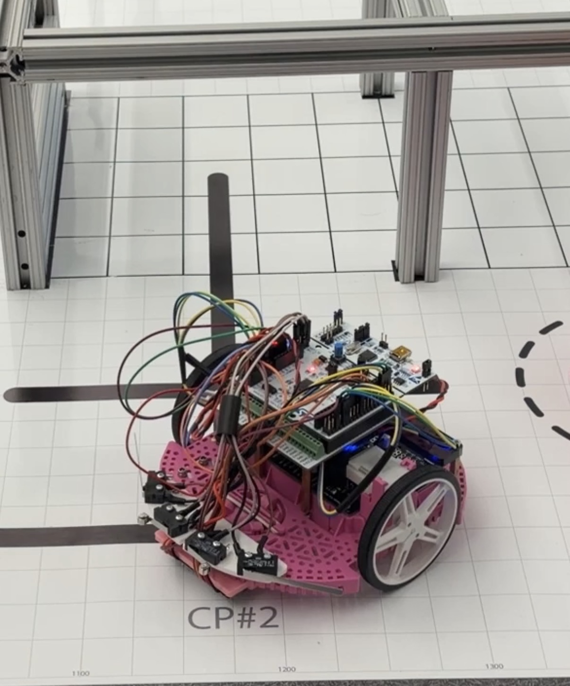

# Romi Autonomous Robot Project

  
  
<em>Autonomous Romi robot developed for Cal Poly ME 405.</em>

---

## Overview

This repository contains the full software implementation for an autonomous Romi robot developed over a full quarter in Cal Poly’s **ME 405: Mechatronics** course. As the final course in the undergraduate mechatronics curriculum, the project brings together controls, embedded systems, sensing, and real-time software into a single integrated robotic system.

Each team approached the final challenge differently, selecting and integrating a combination of sensors and measurement systems such as reflectance sensors, ultrasonic sensors, mechanical switches, IMUs, and encoders to maintain reliable navigation and respond to obstacles. The course layout shown below provides context for the design decisions and robot behaviors implemented in this project.

The software is built around a cooperative, priority-based task scheduler that coordinates sensing, estimation, and control in real time. Core functionality includes closed-loop motor control, line following, state estimation using encoder and IMU data, and higher-level course navigation with trajectory execution and event handling.

The architecture is intentionally modular. Hardware drivers provide low-level access to motors, encoders, line sensors, and the IMU, while higher-level tasks manage control logic, navigation, and user interaction. Communication between tasks is handled through shared variables and queues, allowing information to move efficiently through the system without tightly coupling each module.

Overall, the project follows a layered control structure in which low-level velocity control supports line following and trajectory tracking, all coordinated by a state-driven navigation task capable of completing the full course.

---

## Course Track

  
  
<em>Full game track used for final course navigation.</em>

The image above shows the full game track that the Romi robot was designed to complete by the end of the quarter. The main course follows a black line from the starting position through five checkpoints. The robot must navigate a long straight section and enter the “parking garage,” where it is required to make contact with the wall before exiting.

It then proceeds through a slalom section without disturbing any of the ping pong balls placed along the path, as each ball adds a two-second penalty to the final time. A checkpoint is only considered complete if the Romi chassis fully covers the marked dot, and all five checkpoints must be completed for a successful run.

Optional cups are available for time deductions if repositioned correctly; however, this feature was not used in this project because the time required to complete that action exceeded the time deduction gained.

---

## Site Navigation

- [Hardware](hardware.md)
- [Software Architecture](software.md)
- [Results](results.md)
- [Repository Map](repo-map.md)