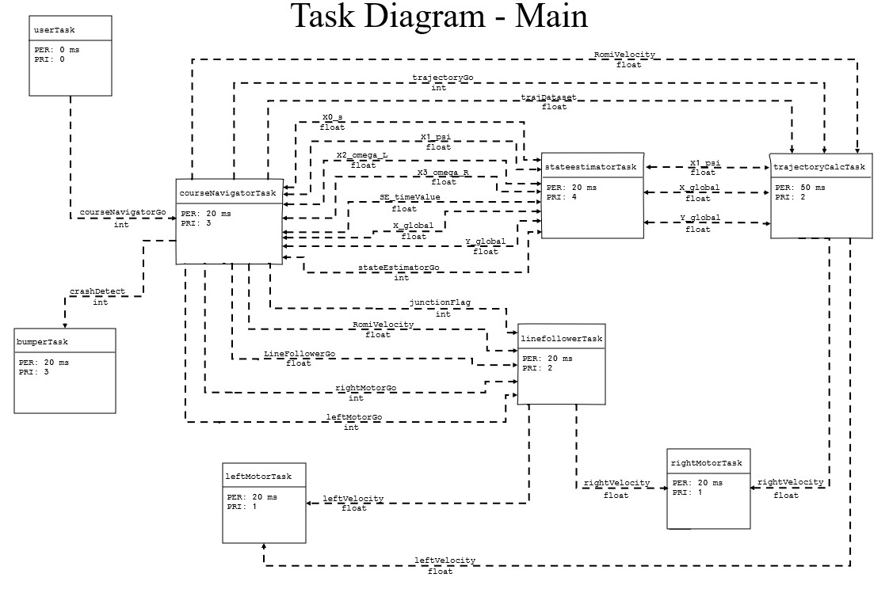
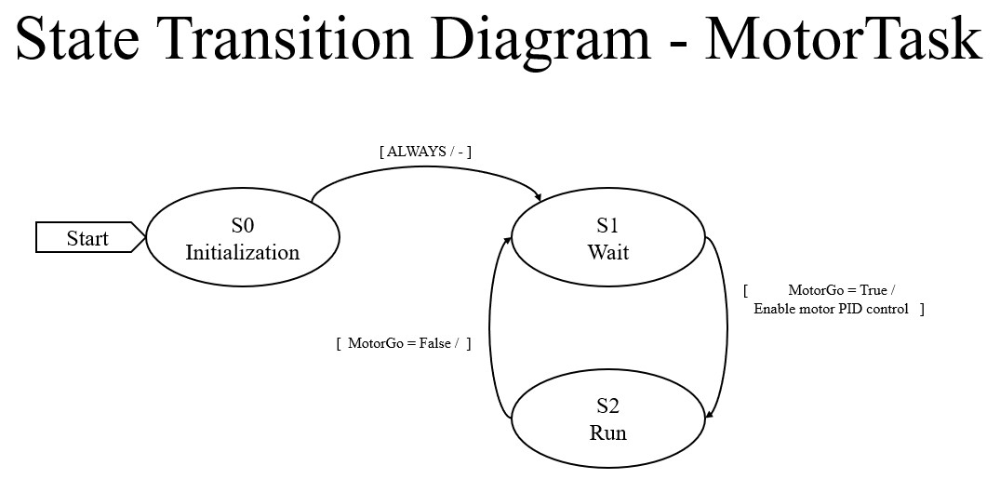
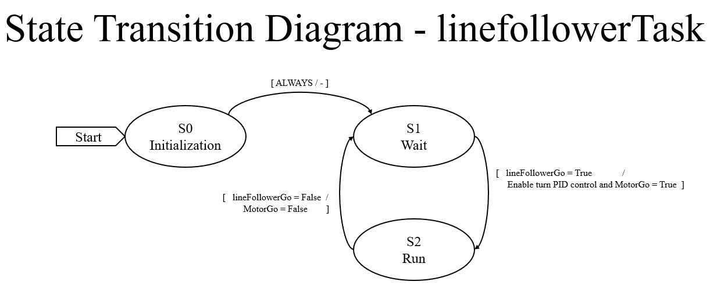
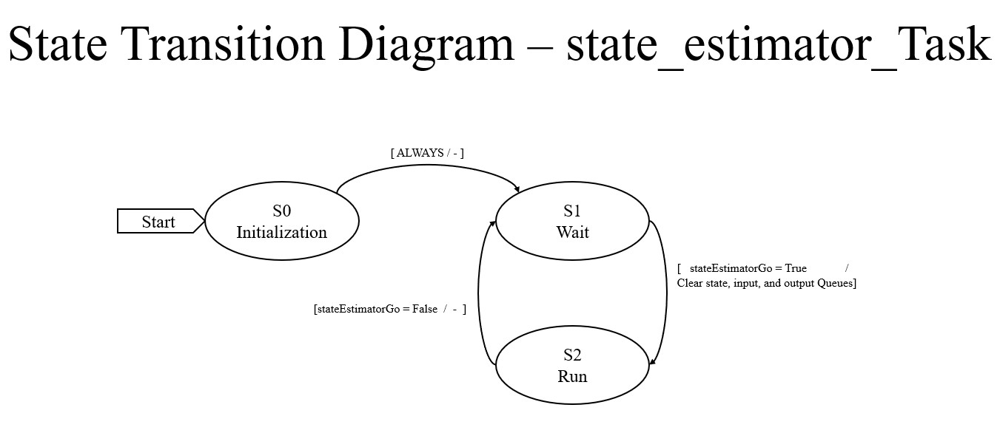
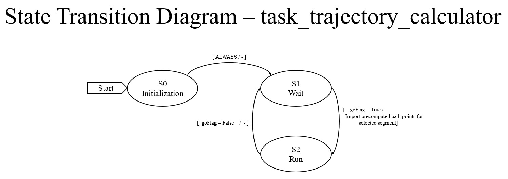
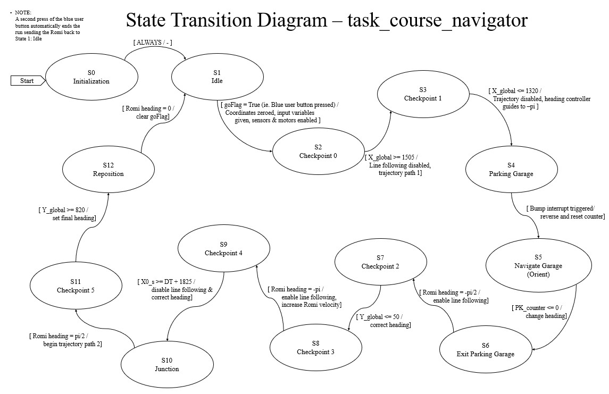
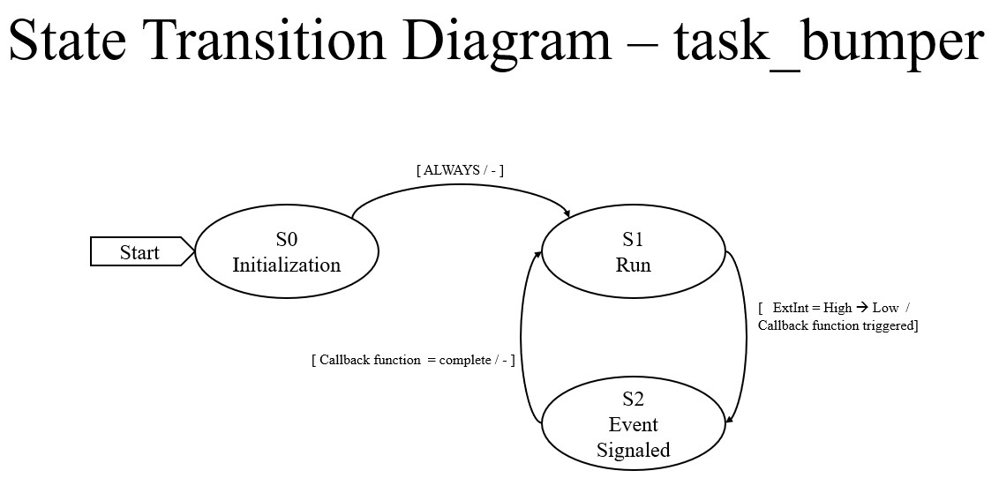
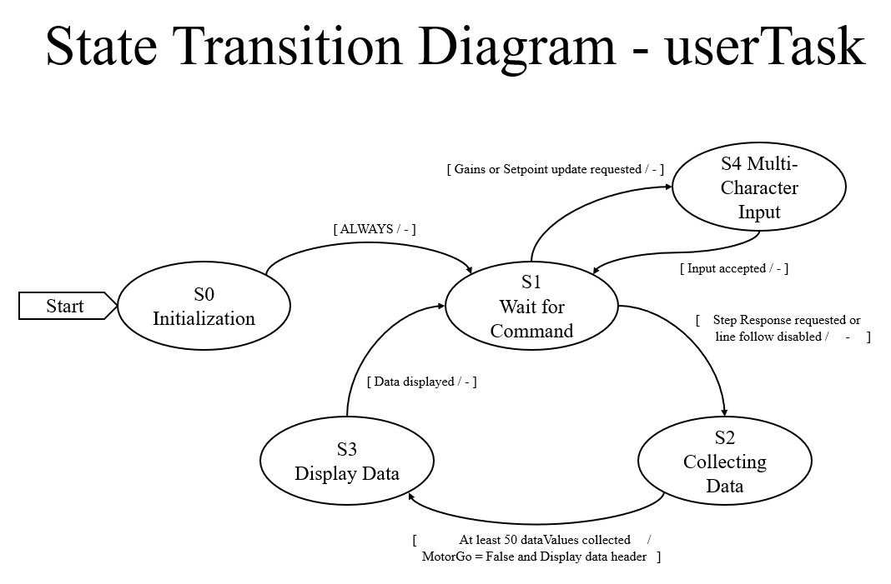

# Software Overview

---

## System Architecture

The software system is organized into a modular, task-based architecture built on a cooperative, priority-based scheduler. The system is divided into two primary layers: hardware drivers and high-level tasks. Drivers provide low-level access to sensors and actuators, while tasks implement sensing, estimation, control, and navigation logic. Each task runs periodically and communicates with other tasks through shared variables and queues, allowing the system to remain modular while maintaining efficient and reliable data flow.

---

## Task Diagram

<div align="center">
  
  <p><em>Task-level architecture showing inter-task communication through shares and queues.</em></p>
</div>

The diagram above illustrates how each task interacts within the system. Lower-level tasks handle sensing and actuation, while higher-level tasks process this information to perform estimation and navigation. Data is passed between tasks using shared variables and queues, allowing asynchronous execution without tightly coupling system components.

---

## Task Scheduling

### Task Periods and Priorities

| Task                        | Period (ms) | Priority |
|-----------------------------|-------------|----------|
| Left Motor Task             | 20          | 1        |
| Right Motor Task            | 20          | 1        |
| User Interface Task         | 0           | 0        |
| Line Follower Task          | 20          | 2        |
| Trajectory Calculator Task  | 50          | 2        |
| Course Navigator Task       | 20          | 3        |
| Bumper Task                 | 20          | 3        |
| State Estimator Task        | 20          | 4        |

The motor tasks run at a moderate rate to maintain closed-loop velocity control, while the line follower, course navigator, bumper task, and state estimator all execute fast enough to support responsive real-time behavior. The state estimator is assigned the highest priority in the system, reflecting the importance of accurate state information for navigation and control. The user interface task is event-driven and runs with a period of 0, allowing it to operate in the background without interfering with the rest of the control system.

---

### Shares and Queues

| Name              | Type  | Data Type     | Producer                          | Consumer                                  |
|-------------------|-------|---------------|-----------------------------------|-------------------------------------------|
| leftMotorGo       | Share | uint8 / bool  | task_course_navigator             | task_motor (left)                         |
| rightMotorGo      | Share | uint8 / bool  | task_course_navigator             | task_motor (right)                        |
| courseNavigatorGo | Share | uint8 / bool  | task_user / task_course_navigator | task_course_navigator / task_user         |
| lineFollowerGo    | Share | uint8 / bool  | task_course_navigator             | task_line_follower                        |
| stateEstimatorGo  | Share | uint8 / bool  | task_course_navigator             | task_state_estimator                      |
| trajectoryGo      | Share | uint8 / bool  | navigator / trajectory            | task_trajectory_calculator                |
| junctionFlag      | Share | uint8 / bool  | task_line_follower                | task_course_navigator                     |
| RomiVelocity      | Share | float         | task_course_navigator             | multiple tasks                            |
| leftVelocity      | Share | float         | multiple tasks                    | task_motor (left)                         |
| rightVelocity     | Share | float         | multiple tasks                    | task_motor (right)                        |
| trajDataset       | Share | float         | task_course_navigator             | task_trajectory_calculator                |
| X0_s              | Share | float         | task_state_estimator              | task_course_navigator                     |
| X1_psi            | Share | float         | estimator / navigator             | multiple tasks                            |
| X2_omega_L        | Share | float         | task_state_estimator              | task_course_navigator                     |
| X3_omega_R        | Share | float         | task_state_estimator              | task_course_navigator                     |
| SE_timeValue      | Share | float         | task_state_estimator              | task_course_navigator                     |
| X_global          | Share | float         | estimator / navigator             | multiple tasks                            |
| Y_global          | Share | float         | estimator / navigator             | multiple tasks                            |
| crashDetect       | Queue | uint8 / int   | task_bumper                       | task_course_navigator                     |

Most system data is transmitted using floating-point shares, while control flags use integer-based boolean representations. A single queue is used for bumper-triggered events, allowing asynchronous communication without interrupting task execution.

---

## Task Layer

### task_motor.py

This task handles low-level motor control by applying PWM commands using encoder feedback and a PID controller. Two instances are created for independent left and right wheel control.

**FSM:**
<div align="center">
  
</div>

---

### task_line_follower.py

This task processes reflectance sensor data to compute a line-following error and generates differential velocity commands. It also detects junctions and publishes a junction flag.

**FSM:**
<div align="center">
  
</div>

---

### task_state_estimator.py

This task fuses encoder and IMU data to estimate position, heading, and velocity. It provides the primary state feedback used throughout the system.

**FSM:**
<div align="center">
  
</div>

---

### task_trajectory_calculator.py

This task implements a pure-pursuit trajectory-following algorithm, generating velocity commands based on a lookahead point and estimated robot position.

**FSM:**
<div align="center">
  
</div>

---

### task_course_navigator.py

This task serves as the high-level state machine controlling overall robot behavior, including checkpoint navigation, garage interaction, and trajectory switching.

**FSM:**
<div align="center">
  
</div>

---

### task_bumper.py

This task detects contact events using interrupt-driven bump sensors and sends events to the navigator through a queue.

**FSM:**
<div align="center">
  
</div>

---

### task_user.py

This task provides a serial interface for starting runs, monitoring system status, and reporting final position and heading.

**FSM:**
<div align="center">
  
</div>

---

## Driver Layer

### motor_driver.py

This file provides the low-level interface for commanding each DC motor. It handles direction control, PWM duty cycle output, and driver enable or disable behavior so that higher-level tasks can command motor effort without dealing directly with pins and timers. A key part of this file is the saturation and direction logic inside `set_effort()`, which maps signed effort commands into motor direction and PWM magnitude:

```python
def set_effort(self, effort: float):
    if effort < 0:
        self.DIR.high()
        if effort < -100:
            effort = -100
    else:
        self.DIR.low()
        if effort > 100:
            effort = 100
    self.PWM.pulse_width_percent(abs(effort))
    self.effort = effort
```

This makes the motor driver simple and reusable: tasks only need to provide a signed effort value, and the driver handles the hardware-specific implementation.

**Class:**
- `Motor`

---

### encoder_driver.py

This file defines the quadrature encoder interface used to measure wheel position and velocity. It tracks timer counts, corrects for 16-bit timer rollover, and converts encoder motion into both linear and angular quantities. The most important logic appears in `update()`, where encoder count changes are computed and rollover is handled explicitly:

```python
def update(self):
    self.delta = self.tim.counter() - self.prev_count
    if self.delta < -32768:
        self.delta += 65536
    elif self.delta > 32767:
        self.delta -= 65536
    self.position -= self.delta
    self.dt = ticks_diff(ticks_us(), self.prev_time) / 1000000.0
    self.prev_count = self.tim.counter()
    self.prev_time = ticks_us()
```

The driver then exposes converted position and velocity values through methods such as `get_position()`, `get_velocity()`, `get_position_rad()`, and `get_velocity_rad()`, allowing the rest of the system to operate in physical units rather than raw counts.

**Class:**
- `Encoder`

---

### line_sensor_driver.py

This file reads the analog reflectance sensors used for line following. Each driver object represents one sensor board and returns the inner, middle, and outer channel values as a tuple for use in higher-level line position calculations. The implementation is intentionally simple:

```python
def get_values(self):
    return self.InnerADC.read_u16(), self.MiddleADC.read_u16(), self.OuterADC.read_u16()
```

This abstraction keeps hardware interaction minimal while allowing higher-level tasks to focus on interpreting the sensor data.

**Class:**
- `Line_Sensor`

---

### imu_driver.py

This file interfaces with the BNO055 IMU over I2C. It handles initialization, mode selection, calibration loading, and retrieval of fused orientation and angular velocity data. The startup sequence verifies communication and places the sensor into NDOF mode:

```python
chip = self.read_u8(self.CHIP_ID)
if chip != 0xA0:
    time.sleep_ms(650)
    chip = self.read_u8(self.CHIP_ID)
    if chip != 0xA0:
        raise OSError("BNO055 not found")

self.op_mode("CONFIG")
self.write_u8(self.SYS_TRIGGER, 0x20)
time.sleep_ms(650)
self.op_mode("NDOF")
```

Calibration data is written during startup to ensure consistent performance:

```python
def write_coeff(self, coeff_bytes: bytes):
    self.op_mode("CONFIG")
    self.write(self.CALIB_START, coeff_bytes)
    self.op_mode("NDOF")
```

This driver enables reliable heading estimation, which is critical for navigation and trajectory tracking.

**Class:**
- `IMU`

---

### voltage_div_driver.py

This file measures battery voltage using an analog input and a voltage divider. It converts ADC readings into a usable voltage value:

```python
def get_voltage(self):
    ADC_out = self.V_div.read_u16()
    voltage = (ADC_out / 65535) * 3.3 * (self.R1 + self.R2) / self.R2 * 1.089
    return voltage
```

This allows the system to monitor battery health and report voltage through the user interface.

**Class:**
- `Voltage_Divider`

---

## Control and Utility Files

### pid_controller.py

This file defines the reusable PID controller used throughout the system for motor velocity regulation, line-following correction, and heading control. It computes proportional, integral, and derivative terms and applies output saturation to maintain stable control behavior.

**Class:**
- `PID_controller`

---

### cotask.py

This file provides the cooperative task scheduler used to execute all system tasks. It defines task timing, priority handling, and the scheduling loop that determines execution order.

---

### task_share.py

This file implements the shared variable and queue system used for inter-task communication. Shares hold the most recent value of a variable, while queues store ordered event data for asynchronous processing.

**Classes:**
- `Share`
- `Queue`

---

## Main Program

### main.py

This file serves as the entry point for the entire system. It initializes all drivers, creates shares and queues, instantiates each task, assigns priorities and periods, and starts the scheduler. The structure of the system is clearly shown in the task registration:

```python
task_list.append(Task(leftMotorTask.run, name="Left Mot. Task", priority=1, period=20))
task_list.append(Task(rightMotorTask.run, name="Right Mot. Task", priority=1, period=20))
task_list.append(Task(linefollowertask.run, name="Line Follower Task", priority=2, period=20))
task_list.append(Task(stateestimatorTask.run, name="State Est. Task", priority=4, period=20))
task_list.append(Task(trajectoryCalculatorTask.run, name="Trajectory Calc. Task", priority=2, period=50))
task_list.append(Task(courseNavigatorTask.run, name="Course Nav. Task", priority=3, period=20))
task_list.append(Task(bumperTask.run, name="Bumper Task", priority=3, period=20))
```

This modular structure allows each subsystem to operate independently while contributing to the overall behavior of the robot.

---

## Summary

The software architecture emphasizes modularity, real-time execution, and structured communication between tasks. Hardware-specific behavior is isolated in driver files, while higher-level tasks coordinate sensing, estimation, and control through a shared scheduling framework. This structure enables the robot to reliably perform line following, trajectory tracking, and autonomous navigation.